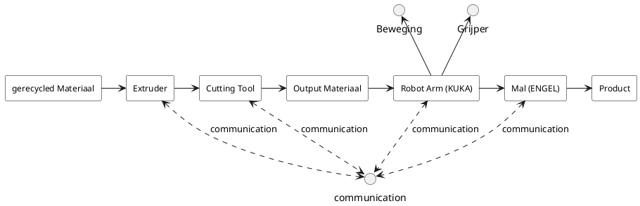
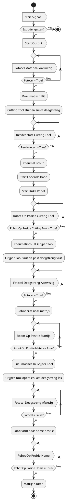

# 2 LFT Afhandelingsproces

In dit hoofdstuk worden de volgende diagrammen en analyses weergegeven: het LFT handling interface diagram (hoofdstuk 2.1) een procesanalyse (hoofdstuk 2.2) en de procesflowchart (2.3).
## 2.1 LFT Interface diagram

In dit diagram worden de volgorde van de verschillende systemen weergeven. Daarnaast word ook weergeven hoe alle losse systemen communiceren.

## 2.2 Processanalyse

In het afhandelingsproces van het LFT-systeem wordt een reeks machines en handelingen gecoördineerd om gerecycled materiaal om te zetten naar een afgewerkt product. De PLC bestuurt en monitort elke stap van het proces. De belangrijkste stappen zijn als volgt:

1. Opstartsignaal en Extruder Start: Het proces begint met een startsignaal dat de extruder activeert. Als de extruder gestart is draait de toevoer van gerecycled materiaal.
2. Materiaalherkenning door Fotocel: Een fotocel op lengte leest uit of het materiaal lang genoeg is geëxtrudeerd om af te snijden. Wanneer het materiaal aanwezig is, wordt met een relais het pneumatische systeem geactiveerd om het materiaal te snijden.
3. Snijden door Cutting Tool: Het cutting tool sluit zich en snijdt de materiaalstroom op de juiste lengte. Een reedcontact sensor controleert of het snijgereedschap in de juiste compleet dichte positie is aangekomen.
4. Transport naar KUKA Robot en Robot Activering: Na het snijden wordt het materiaal via een transportband naar de robot gebracht. De KUKA-robot beweegt naar de snijpositie om het materiaal op te pakken.
5. Grijpen van het Materiaal: De grijper van de robot sluit zich en pakt het gesneden materiaal. Een fotocel bevestigt of het materiaal goed vastgepakt is voordat de robot doorgaat.
6. Verplaatsing naar Matrijs: De robot beweegt naar de matrijs (ENGEL) en plaatst het materiaal in de mal.
7. Loslaten van het Materiaal en Terugkeer naar Homepositie: De grijper laat het materiaal los in de matrijs. Een fotocel bevestigt dat het materiaal is vrijgegeven. Vervolgens keert de robot terug naar de homepositie om klaar te staan voor de volgende cyclus.
8. Sluiten van de Matrijs: Tot slot sluit de matrijs om het materiaal verder te verwerken tot het eindproduct.

Deze cyclus wordt herhaald voor elke nieuwe lading materiaal, waarbij de volgorde en timing bewaakt wordt om een soepel productieproces te garanderen.

## 2.3 Flowchart

In de flowchart wordt het volledige proces gedetaileerd stap voor stap weergeven.
Deze flowchart biedt een overzicht van het geautomatiseerde productieproces waarin een PLC, extruder, snijtool en KUKA-robot samenwerken. Stap voor stap toont de flowchart hoe deze onderdelen via signalen en sensoren met elkaar communiceren om de hamster door de productiecyclus te begeleiden. De PLC stuurt elk onderdeel aan en zorgt dat het materiaal wordt bewerkt, verplaatst en uiteindelijk in de pers wordt gevormd.

Zo geeft het schema een helder beeld van de samenwerking tussen de machineonderdelen door alle processtappen heen.

