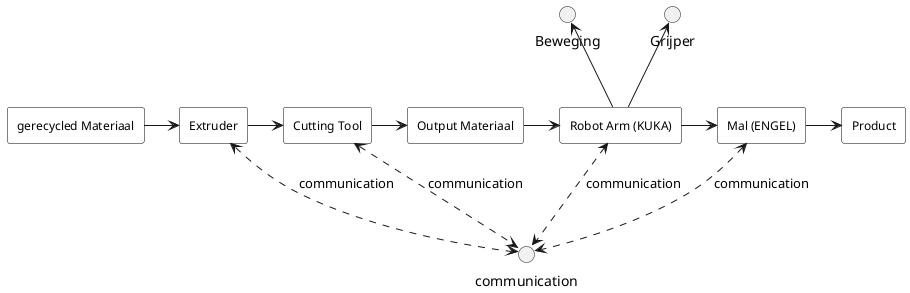
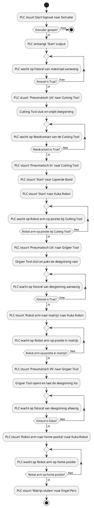

In dit hoofdstuk worden twee diagrammen weergeven:

Interface diagram (hoofdstuk 2.1): In dit diagram worden de volgorde van de verschillende systemen weergeven. Daarnaast word ook weergeven hoe alle losse systemen comminuceren.

Flow chart (hoofdstuk 2.2): In de flowchart wordt het volledige proces gedetaileerd stap voor stap weergeven.

# 2.1 LFT Interface diagram

# 2.2 LFT proces flowchart

