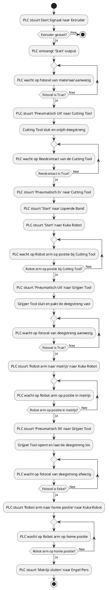

# 2 LFT Afhandelingsproces

# 2.1 Flowchart
Deze flowchart biedt een overzicht van het geautomatiseerde productieproces waarin een PLC, extruder, snijtool en KUKA-robot samenwerken. Stap voor stap toont de flowchart hoe deze onderdelen via signalen en sensoren met elkaar communiceren om de hamster door de productiecyclus te begeleiden. De PLC stuurt elk onderdeel aan en zorgt dat het materiaal wordt bewerkt, verplaatst en uiteindelijk in de pers wordt gevormd.

Zo geeft het schema een helder beeld van de samenwerking tussen de machineonderdelen door alle processtappen heen.

