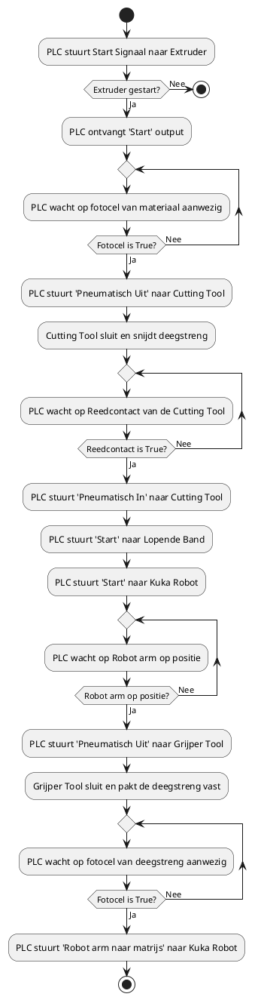

# 2 LFT Handling process

```plantuml
@startuml
start

:PLC stuurt Start Signaal naar Extruder;
if (Extruder gestart?) then (Ja)
    :PLC ontvangt 'Start' output;
else (Nee)
    stop
endif

repeat
    :PLC wacht op fotocel van materiaal aanwezig;
    repeat while (Fotocel is True?) is (Nee) not (Ja)
        :PLC stuurt 'Pneumatisch Uit' naar Cutting Tool;
        :Cutting Tool sluit en snijdt deegstreng;
repeat
    :PLC wacht op Reedcontact van de Cutting Tool;
    repeat while (Reedcontact is True?) is (Nee) not (Ja)
        :PLC stuurt 'Pneumatisch In' naar Cutting Tool;
        :PLC stuurt 'Start' naar Lopende Band;
        :PLC stuurt 'Start' naar Kuka Robot;
repeat
    :PLC wacht op Robot arm op positie;
    repeat while (Robot arm op positie?) is (Nee) not (Ja)
        :PLC stuurt 'Pneumatisch Uit' naar Grijper Tool;
        :Grijper Tool sluit en pakt de deegstreng vast;
 repeat
    :PLC wacht op fotocel van deegstreng aanwezig;
    repeat while (Fotocel is True?) is (Nee) not (Ja)
        :PLC stuurt 'Robot arm naar matrijs' naar Kuka Robot;       


stop
@enduml
```
