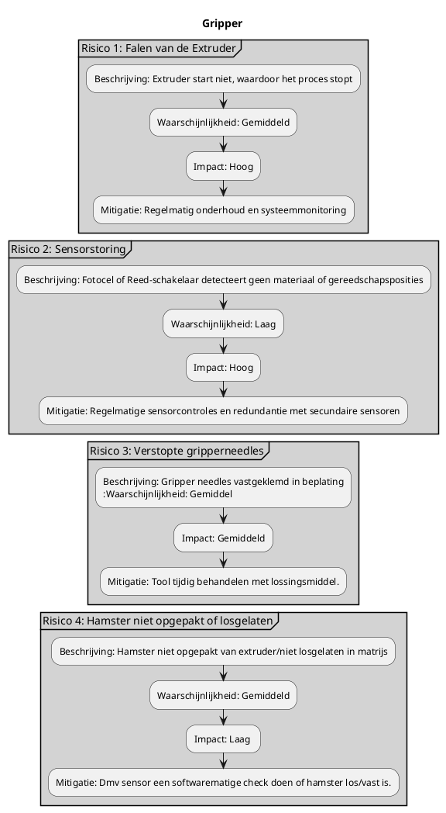

# 4 Risicoanalyse

De volgende risicoanalyse beschrijft mogelijke risico's in het LFT-handlingsproces en de bijbehorende mitigeringsstrategieën.
Ten eerste de analyse van de grippertool



Hieronder de risicoanalyse van het overkoepelende systeem, de KUKA robotarm, de extruder, cutting tool, de ENGEL en de communicatie hiertussen.


```plantuml
@startuml
title Systeem

    skinparam partition {
        BorderColor black
        BackgroundColor lightGrey
    }
    partition "Risico 5: Pneumatisch Systeem Falen" {
        :Beschrijving: Falen van het pneumatische systeem verhindert de werking van de grijper;
        :Waarschijnlijkheid: Gemiddeld;
        :Impact: Hoog;
        :Mitigatie: Noodstopprocedures en regelmatige inspectie van pneumatische leidingen;
    }
    detach
    partition "Risico 6: Misalignment van Robotarm" {
        :Beschrijving: Robotarm op incorrecte positie;
        :Waarschijnlijkheid: Laag;
        :Impact: Gemiddeld;
        :Mitigatie: Initiele calibratie dmv verplaatsbaar werkobject; 
    }
    detach
    partition "Risico 7: Warmte" {
        :Beschrijving: De extruder geeft warmte af en staat niet in het hekwerk
        :Waarschijnlijkheid: Gemiddel;
        :Impact: Gemiddeld;
        :Mitigatie: Afstand houden en waarschuwenbord dat het heet is.;
    }
    detach
    partition "Risico 8: Materiaal te koud" {
        :Beschrijving: Materiaal teveel afgekoeld, waardoor oppakken niet meer mogelijk is.;
        :Waarschijnlijkheid: Gemiddeld;
        :Impact: Gemiddeld;
        :Mitigatie: Extruder stopzetten na het cutten tot de pers klaar is, om niet af te koelen in de buitenlucht.;
    }

@enduml
