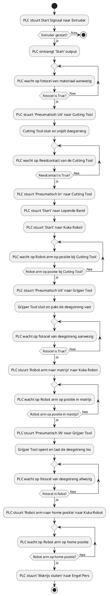
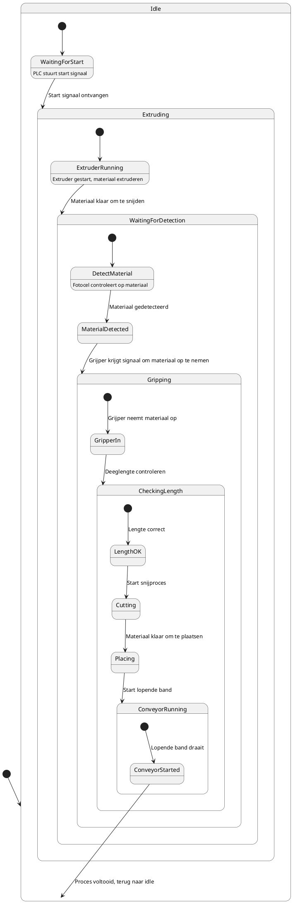
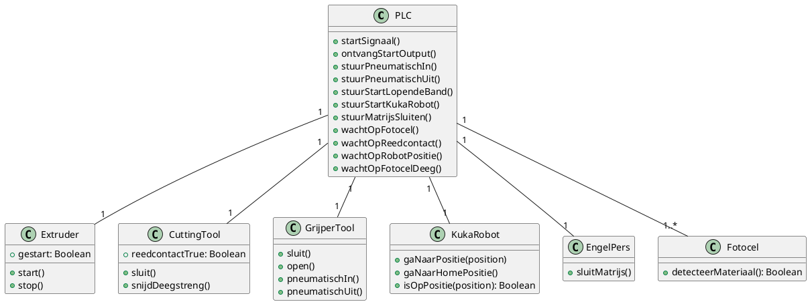

# grafiek PLC aansturing

```plantuml
@startuml
start

:PLC stuurt Start Signaal naar Extruder;
if (Extruder gestart?) then (Ja)
    :PLC ontvangt 'Start' output;
else (Nee)
    stop
endif

repeat
    :PLC wacht op fotocel van materiaal aanwezig;
    repeat while (Fotocel is True?) is (Nee) not (Ja)
        :PLC stuurt 'Pneumatisch Uit' naar Cutting Tool;
        :Cutting Tool sluit en snijdt deegstreng;
repeat
    :PLC wacht op Reedcontact van de Cutting Tool;
    repeat while (Reedcontact is True?) is (Nee) not (Ja)
        :PLC stuurt 'Pneumatisch In' naar Cutting Tool;
        :PLC stuurt 'Start' naar Lopende Band;
        :PLC stuurt 'Start' naar Kuka Robot;
repeat
    :PLC wacht op Robot arm op positie bij Cutting Tool;
    repeat while (Robot arm op positie bij Cutting Tool?) is (Nee) not (Ja)
        :PLC stuurt 'Pneumatisch Uit' naar Grijper Tool;
        :Grijper Tool sluit en pakt de deegstreng vast;
 repeat
    :PLC wacht op fotocel van deegstreng aanwezig;
    repeat while (Fotocel is True?) is (Nee) not (Ja)
        :PLC stuurt 'Robot arm naar matrijs' naar Kuka Robot;       
repeat
    :PLC wacht op Robot arm op positie in matrijs;
repeat while (Robot arm op positie in matrijs?) is (Nee) not (Ja)
        :PLC stuurt 'Pneumatisch IN' naar Grijper Tool;
        :Grijper Tool opent en laat de deegstreng los;
 repeat
    :PLC wacht op fotocel van deegstreng afwezig;
    repeat while (Fotocel is False?) is (Nee) not (Ja)
        :PLC stuurt 'Robot arm naar home positie' naar Kuka Robot;   
 repeat
    :PLC wacht op Robot arm op home positie;
    repeat while (Robot arm op home positie?) is (Nee) not (Ja)
        :PLC stuurt 'Matrijs sluiten' naar Engel Pers; 
stop
@enduml
```

```plantuml
@startuml
[*] --> Idle

state Idle {
    [*] --> WaitingForStart
    WaitingForStart : PLC stuurt start signaal

    WaitingForStart --> Extruding : Start signaal ontvangen
}

state Extruding {
    [*] --> ExtruderRunning
    ExtruderRunning : Extruder gestart, materiaal extruderen
    ExtruderRunning --> WaitingForDetection : Materiaal klaar om te snijden
}

state WaitingForDetection {
    [*] --> DetectMaterial
    DetectMaterial : Fotocel controleert op materiaal

    DetectMaterial --> MaterialDetected : Materiaal gedetecteerd
    MaterialDetected --> Gripping : Grijper krijgt signaal om materiaal op te nemen
}

state Gripping {
    [*] --> GripperIn : Grijper neemt materiaal op
    GripperIn --> CheckingLength : Deeglengte controleren
}

state CheckingLength {
    [*] --> LengthOK : Lengte correct
    LengthOK --> Cutting : Start snijproces
    Cutting --> Placing : Materiaal klaar om te plaatsen
    Placing --> ConveyorRunning : Start lopende band
}

state ConveyorRunning {
    [*] --> ConveyorStarted : Lopende band draait
    ConveyorStarted --> Idle : Proces voltooid, terug naar idle
}

@enduml
```

```plantuml
@startuml
class PLC {
    +startSignaal()
    +ontvangStartOutput()
    +stuurPneumatischIn()
    +stuurPneumatischUit()
    +stuurStartLopendeBand()
    +stuurStartKukaRobot()
    +stuurMatrijsSluiten()
    +wachtOpFotocel()
    +wachtOpReedcontact()
    +wachtOpRobotPositie()
    +wachtOpFotocelDeeg()
}

class Extruder {
    +gestart: Boolean
    +start()
    +stop()
}

class CuttingTool {
    +sluit()
    +snijdDeegstreng()
    +reedcontactTrue: Boolean
}

class GrijperTool {
    +sluit()
    +open()
    +pneumatischIn()
    +pneumatischUit()
}

class KukaRobot {
    +gaNaarPositie(position)
    +gaNaarHomePositie()
    +isOpPositie(position): Boolean
}

class EngelPers {
    +sluitMatrijs()
}

class Fotocel {
    +detecteerMateriaal(): Boolean
}

PLC "1" -- "1" Extruder
PLC "1" -- "1" CuttingTool
PLC "1" -- "1" GrijperTool
PLC "1" -- "1" KukaRobot
PLC "1" -- "1" EngelPers
PLC "1" -- "1..*" Fotocel
@enduml
```

