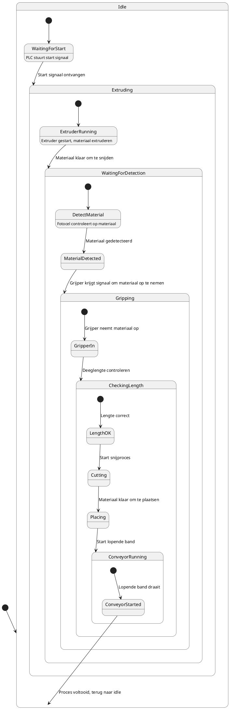
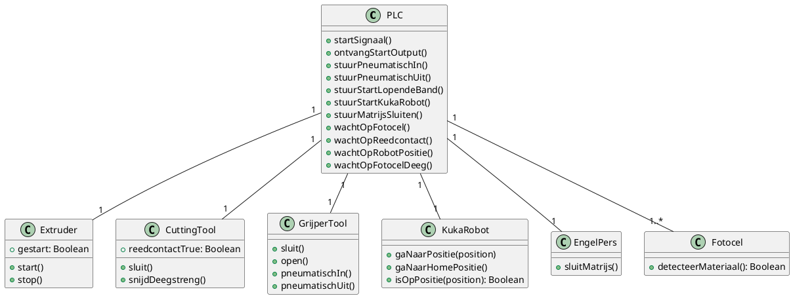

# grafiek PLC aansturing

```plantuml
@startuml
[*] --> Idle

state Idle {
    [*] --> WaitingForStart
    WaitingForStart : PLC stuurt start signaal

    WaitingForStart --> Extruding : Start signaal ontvangen
}

state Extruding {
    [*] --> ExtruderRunning
    ExtruderRunning : Extruder gestart, materiaal extruderen
    ExtruderRunning --> WaitingForDetection : Materiaal klaar om te snijden
}

state WaitingForDetection {
    [*] --> DetectMaterial
    DetectMaterial : Fotocel controleert op materiaal

    DetectMaterial --> MaterialDetected : Materiaal gedetecteerd
    MaterialDetected --> Gripping : Grijper krijgt signaal om materiaal op te nemen
}

state Gripping {
    [*] --> GripperIn : Grijper neemt materiaal op
    GripperIn --> CheckingLength : Deeglengte controleren
}

state CheckingLength {
    [*] --> LengthOK : Lengte correct
    LengthOK --> Cutting : Start snijproces
    Cutting --> Placing : Materiaal klaar om te plaatsen
    Placing --> ConveyorRunning : Start lopende band
}

state ConveyorRunning {
    [*] --> ConveyorStarted : Lopende band draait
    ConveyorStarted --> Idle : Proces voltooid, terug naar idle
}

@enduml
```

```plantuml
@startuml
class PLC {
    +startSignaal()
    +ontvangStartOutput()
    +stuurPneumatischIn()
    +stuurPneumatischUit()
    +stuurStartLopendeBand()
    +stuurStartKukaRobot()
    +stuurMatrijsSluiten()
    +wachtOpFotocel()
    +wachtOpReedcontact()
    +wachtOpRobotPositie()
    +wachtOpFotocelDeeg()
}

class Extruder {
    +gestart: Boolean
    +start()
    +stop()
}

class CuttingTool {
    +sluit()
    +snijdDeegstreng()
    +reedcontactTrue: Boolean
}

class GrijperTool {
    +sluit()
    +open()
    +pneumatischIn()
    +pneumatischUit()
}

class KukaRobot {
    +gaNaarPositie(position)
    +gaNaarHomePositie()
    +isOpPositie(position): Boolean
}

class EngelPers {
    +sluitMatrijs()
}

class Fotocel {
    +detecteerMateriaal(): Boolean
}

PLC "1" -- "1" Extruder
PLC "1" -- "1" CuttingTool
PLC "1" -- "1" GrijperTool
PLC "1" -- "1" KukaRobot
PLC "1" -- "1" EngelPers
PLC "1" -- "1..*" Fotocel
@enduml
```

