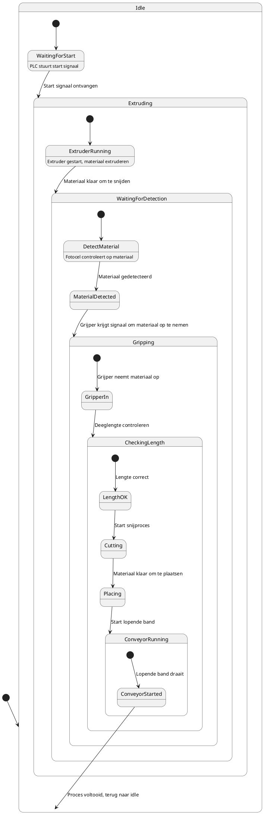

# grafiek PLC aansturing

```plantuml
@startuml
[*] --> Idle

state Idle {
    [*] --> WaitingForStart
    WaitingForStart : PLC stuurt start signaal

    WaitingForStart --> Extruding : Start signaal ontvangen
}

state Extruding {
    [*] --> ExtruderRunning
    ExtruderRunning : Extruder gestart, materiaal extruderen
    ExtruderRunning --> WaitingForDetection : Materiaal klaar om te snijden
}

state WaitingForDetection {
    [*] --> DetectMaterial
    DetectMaterial : Fotocel controleert op materiaal

    DetectMaterial --> MaterialDetected : Materiaal gedetecteerd
    MaterialDetected --> Gripping : Grijper krijgt signaal om materiaal op te nemen
}

state Gripping {
    [*] --> GripperIn : Grijper neemt materiaal op
    GripperIn --> CheckingLength : Deeglengte controleren
}

state CheckingLength {
    [*] --> LengthOK : Lengte correct
    LengthOK --> Cutting : Start snijproces
    Cutting --> Placing : Materiaal klaar om te plaatsen
    Placing --> ConveyorRunning : Start lopende band
}

state ConveyorRunning {
    [*] --> ConveyorStarted : Lopende band draait
    ConveyorStarted --> Idle : Proces voltooid, terug naar idle
}

@enduml
```

